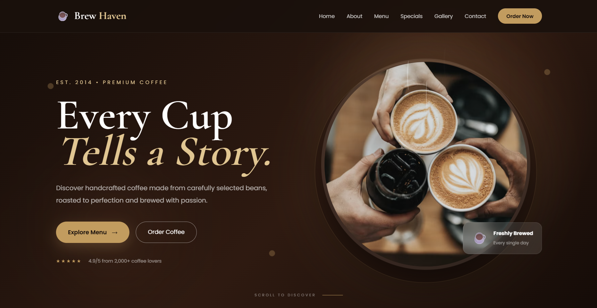
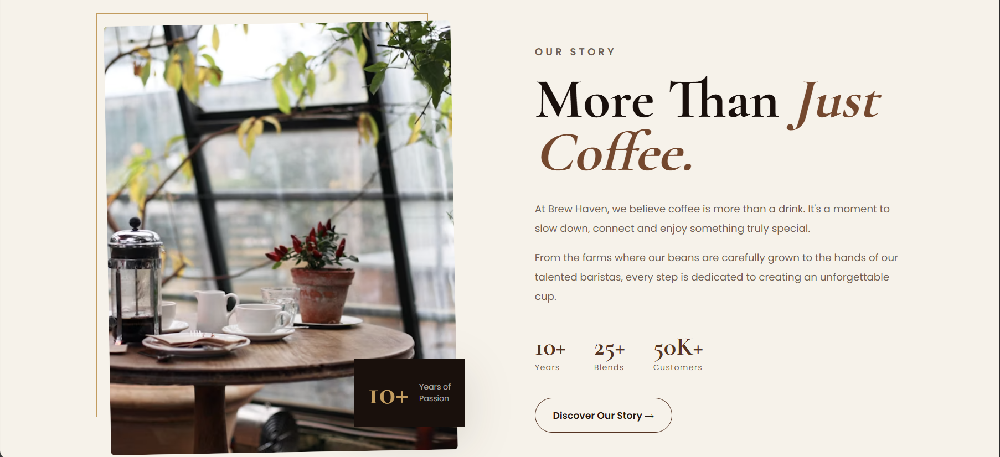
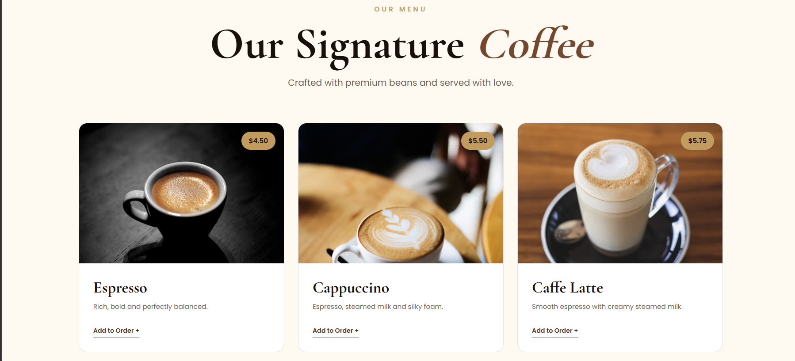
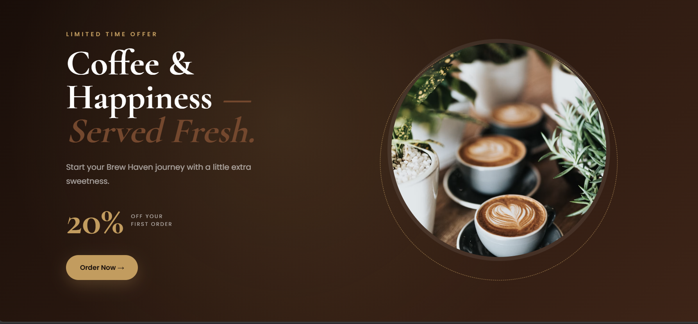
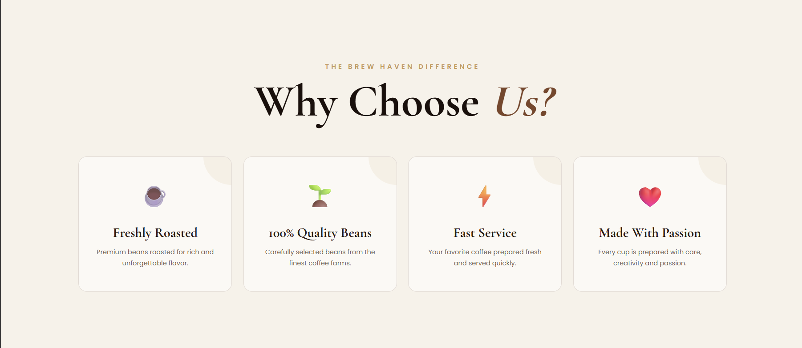
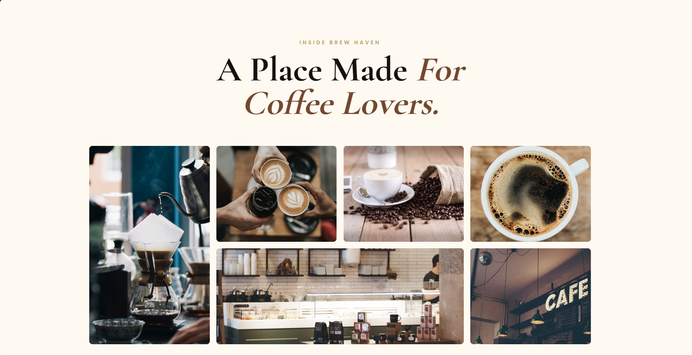
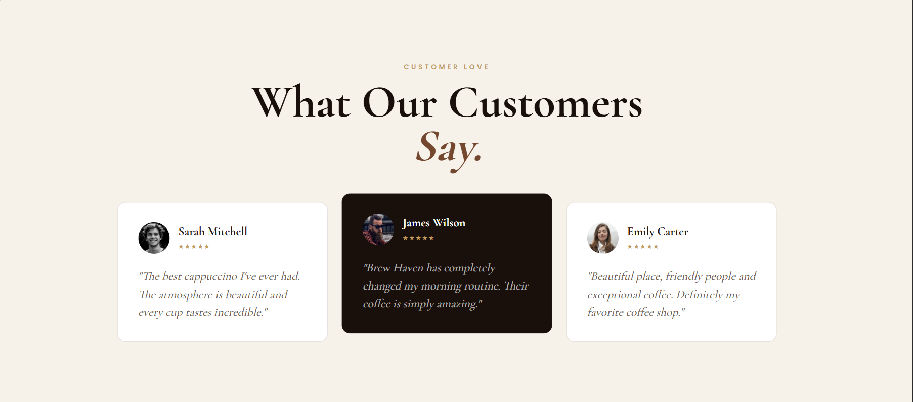
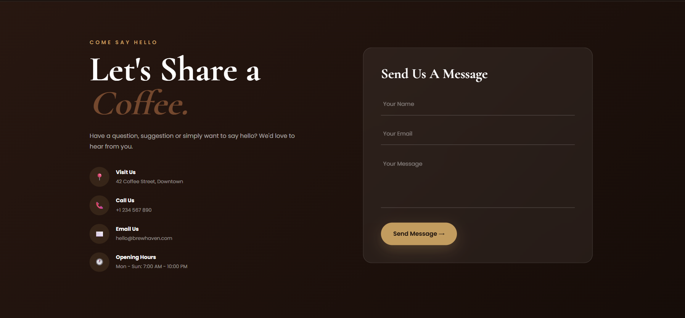
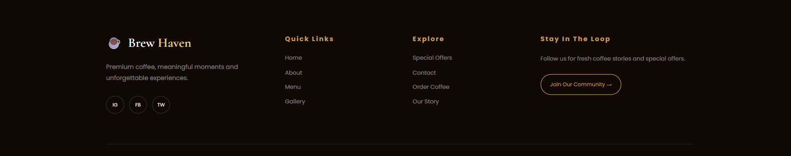

# ☕ COFFEE WEBSITE

## Screenshots

# ☕ Coffee Shop Website

A modern and responsive **Coffee Shop Website** created using **HTML5 and CSS3**.

This project was built as a front-end practice project to improve my skills in website structure, styling, layouts, responsiveness, and UI design.

## 🚀 Features

* ☕ Modern coffee shop design
* 📱 Fully responsive layout
* 🎨 Clean and attractive UI
* 🧭 Navigation bar
* 🏠 Hero/Home section
* ☕ Coffee menu section
* 📖 About section
* 📞 Contact section
* 🖼️ Coffee and website images
* ✨ Smooth CSS styling and hover effects

## 🛠️ Technologies Used

* HTML5
* CSS3

> No JavaScript or external frameworks were used in this project.

### 🏠 Home Page

### ☕ Coffee Section

### 📖 About Section

### 📞 Contact Section

## 💻 How to Run

1. Download or clone this repository.
2. Open the project folder.
3. Open `index.html` in your browser.

Or use **Live Server** in VS Code for a better development experience.

## 🎯 Purpose of This Project

The main purpose of this project is to practice:

* HTML page structure
* CSS styling
* Flexbox
* CSS Grid
* Responsive design
* Navigation layouts
* Cards and sections
* Hover effects
* Web page organization

## 🔮 Future Improvements

In the future, I can improve this project by adding:

* JavaScript functionality
* Shopping cart
* Online coffee ordering
* Login/Register system
* Backend integration
* Database connectivity
* Animations and interactive features

## 👨‍💻 Author

**Achind Pal**

This project is created for learning and practicing web development.

⭐ If you like this project, feel free to star the repository!
